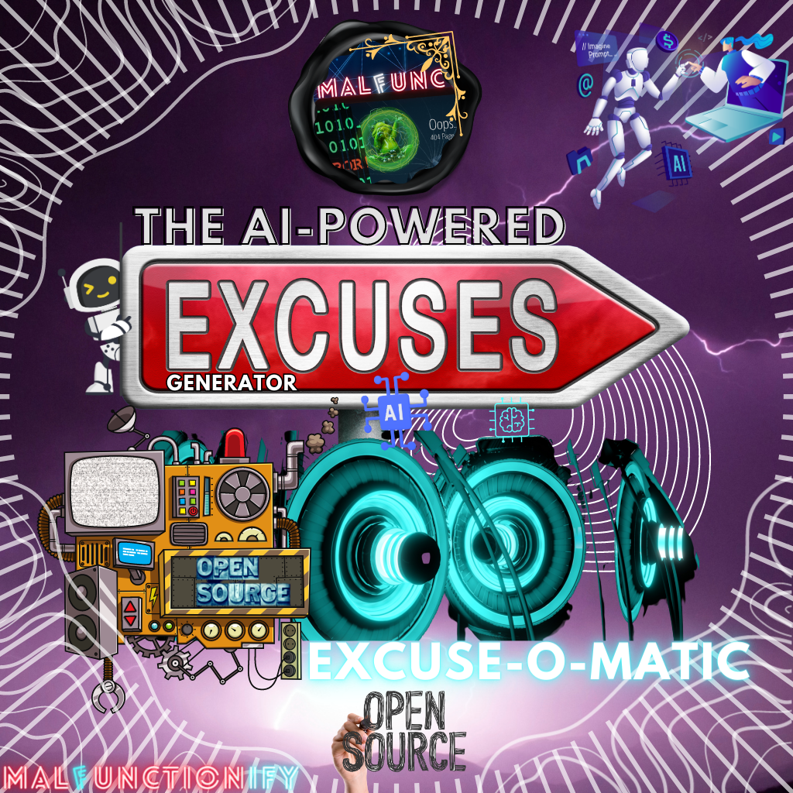

# Excuse-o-Matic AI: The AI-Powered Random Excuse Generator



[Excuse-o-Matic AI](https://malfunctionify.github.io/YouTubeAssets/Excuse-o-Matic-AI/), also known as the AI-Powered Random Excuse Generator, is an innovative tool that generates hilarious and unique excuses for a variety of situations and a remarkable showcase of my programming skills across various languages and frameworks.

With expertise in Python, JavaScript, NodeJS, C#, SQL, TypeScript, PHP, and more, I have developed this innovative tool that harnesses the power of advanced artificial intelligence.

Excuse-o-Matic AI exemplifies my ability to code and create seamlessly across diverse programming languages, crafting a seamless user experience and delivering a continuous stream of hilarious and unique excuses. 

This project not only demonstrates my proficiency in programming but also highlights my creative problem-solving approach and dedication to pushing the boundaries of what can be achieved in software development.

Powered by advanced artificial intelligence, this program takes excuse generation to a whole new level, providing you with an endless stream of creative and entertaining alibis.

Explore Excuse-o-Matic AI and witness firsthand my skills in action, as I bring together technology and comedy to entertain and amuse users.

## Features
- **Simple to use**: Excuse-o-Matic AI is super simple to use, and learning it's codebase has been described as "Easier than eatig a peace of cake".

- **AI-Powered Excuse Generation**: Excuse-o-Matic AI leverages state-of-the-art artificial intelligence algorithms to generate random and funny excuses that are sure to bring a smile to your face.

- **Wide Range of Scenarios**: Whether you need an excuse for being late, missing a deadline, or simply wanting to lighten the mood, Excuse-o-Matic AI has got you covered with a diverse collection of excuse templates.

- **Endless Excuse Possibilities**: With Excuse-o-Matic AI, you'll never run out of excuses. The AI algorithm ensures that each excuse is unique and unpredictable, guaranteeing a continuous supply of laughter-inducing alibis.

## Local Usage
1. Clone the Excuse-o-Matic AI repository to your local machine.
2. Install the necessary dependencies by running `npm install` or `pip install -r requirements.txt`, depending on your preferred programming language.
3. Run the Excuse-o-Matic AI program using the provided command-line interface or web interface.
4. Sit back, relax, and enjoy the hilarious excuses generated by the AI algorithm.

## Supported Programming Languages:
Excuse-o-Matic AI is designed to be versatile, allowing users to run the program in their preferred programming language.
The core algorithm, which generates the random and humorous excuses, relies on pre-generated excuses and can be implemented using familiar constructs in any supported language.
The provided list of supported technologies covers a wide range of categories and serves as a starting point for users to explore different language options, including:
### Programming Languages:
```
Python
JavaScript
NodeJS
Ruby
Go
Rust
TypeScript
PHP
C#
VB.Net
Kotlin
Swift
C++
Java
Scala
Perl
Lua
Bash
```
### Web Development Frameworks and Environments:
```
ReactJS
AngularJS
VueJS
Flask
Drogon
PWA
WordPress
Bootstrap
ExpressJS
FastAPI
Django
```
### Other Technologies and Tools:
```
XML
CSS3
HTML5
JSON
NoSQL
Cloudflare
ChatGPT OpenAI API
MySQL
SQLite
MariaDB
Chrome Extension
Edge Extension
Firefox Extension
Brave Extension
Opera Extension
Safari Extension
```
These diverse categories provide a vast array of choices for developers to utilize Excuse-o-Matic AI in various programming languages, web development frameworks, and other associated technologies.
Whether you're building a web application using ReactJS or exploring NoSQL databases for data storage, Excuse-o-Matic AI can be seamlessly integrated into your preferred tech stack.
Feel free to explore, experiment, and create hilarious excuses in the language, framework, or environment that suits your project best.
Whether you're comfortable with Python's simplicity, JavaScript's versatility, or any other language's strengths, you can freely leverage Excuse-o-Matic AI's logic to generate hilarious excuses in your preferred programming environment.
The program's flexibility allows developers to unleash their creativity and customize the user experience to their liking.
Enjoy the freedom to run Excuse-o-Matic AI in any supported programming language and let the laughter begin!

## Contribution
Contributions to Excuse-o-Matic AI are always welcome! If you have any ideas for improvements, new features, or additional excuse templates, feel free to open a pull request. Let's make the Excuse-o-Matic AI even more entertaining together!

## License
Excuse-o-Matic AI is open-source and free for use. You are welcome to modify and distribute the code as per the terms of the [MIT License](LICENSE).
