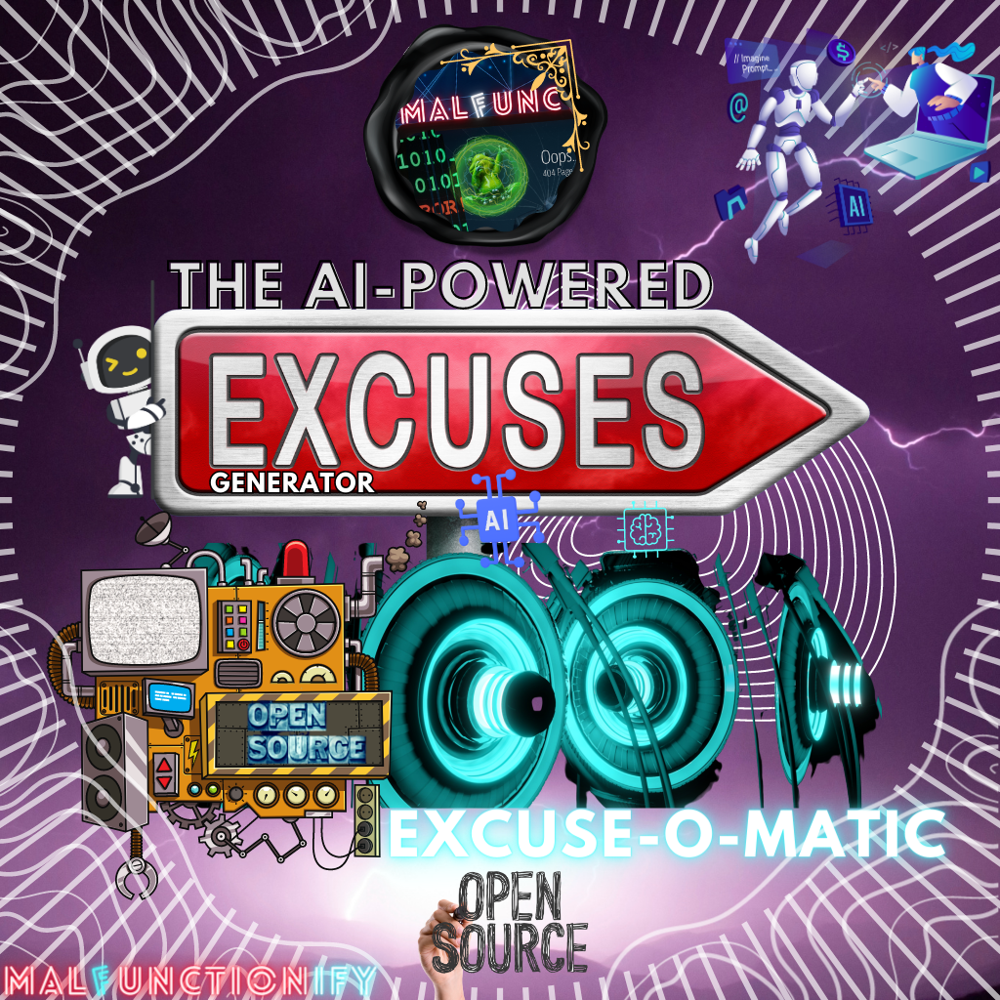

# Excuse-o-Matic AI: The AI-Powered Random Excuse Generator

Excuse-o-Matic AI, also known as the AI-Powered Random Excuse Generator, is an innovative tool that generates hilarious and unique excuses for a variety of situations. Powered by advanced artificial intelligence, this program takes excuse generation to a whole new level, providing you with an endless stream of creative and entertaining alibis.

## Features
- **AI-Powered Excuse Generation**: Excuse-o-Matic AI leverages state-of-the-art artificial intelligence algorithms to generate random and funny excuses that are sure to bring a smile to your face.

- **Wide Range of Scenarios**: Whether you need an excuse for being late, missing a deadline, or simply wanting to lighten the mood, Excuse-o-Matic AI has got you covered with a diverse collection of excuse templates.

- **Endless Excuse Possibilities**: With Excuse-o-Matic AI, you'll never run out of excuses. The AI algorithm ensures that each excuse is unique and unpredictable, guaranteeing a continuous supply of laughter-inducing alibis.

## Local Usage
1. Clone the Excuse-o-Matic AI repository to your local machine.
2. Install the necessary dependencies by running `npm install` or `pip install -r requirements.txt`, depending on your preferred programming language.
3. Run the Excuse-o-Matic AI program using the provided command-line interface or web interface.
4. Sit back, relax, and enjoy the hilarious excuses generated by the AI algorithm.

## Supported Programming Languages:
Excuse-o-Matic AI is designed to be versatile, allowing users to run the program in their preferred programming language. While the codebase is primarily written in Python, the underlying logic can be easily adapted to other programming languages as well. The core algorithm, which generates the random and humorous excuses, relies on language-agnostic concepts and can be implemented using familiar constructs in any supported language. The provided list of supported languages, including Python, JavaScript, NodeJS, Ruby, Go, Rust, TypeScript, PHP, C#, and VB.Net, serves as a starting point for users to explore different language options. Whether you're comfortable with Python's simplicity, JavaScript's versatility, or any other language's strengths, you can freely leverage Excuse-o-Matic AI's logic to generate hilarious excuses in your preferred programming environment. The program's flexibility allows developers to unleash their creativity and customize the user experience to their liking. Enjoy the freedom to run Excuse-o-Matic AI in any supported programming language and let the laughter begin!
Supported Programming Languages:
1. Python
2. JavaScript
3. NodeJS
4. Ruby
5. Go
6. Rust
7. TypeScript
8. PHP
9. C#
10. VB.Net

## Contribution
Contributions to Excuse-o-Matic AI are always welcome! If you have any ideas for improvements, new features, or additional excuse templates, feel free to open a pull request. Let's make the Excuse-o-Matic AI even more entertaining together!

## License
Excuse-o-Matic AI is open-source and free for use. You are welcome to modify and distribute the code as per the terms of the [MIT License](LICENSE).
